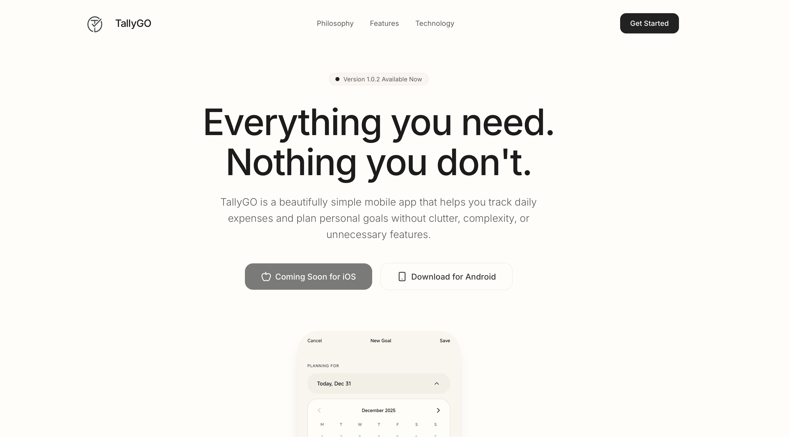

# TallyGO

**Simple finances. Clear goals.**

TallyGO is a beautifully simple mobile app that helps you track daily expenses and plan personal goals without clutter, complexity, or unnecessary features.

## About TallyGO

TallyGO is designed for people who want to manage their money and goals without the overwhelming complexity of traditional finance apps. Built with a minimalist philosophy, it focuses on what truly matters: tracking your daily spending and planning your personal goals.

### Key Features

#### 📊 Frictionless Expense Tracking
- **Quick Entry**: Just description + amount. That's it.
- **Master Totals**: Running daily totals always visible.
- **Zero Stress**: Edit or delete entries anytime.

#### 🎯 Intentional Goal Planning
- **10-Day Agenda**: A rolling view of what matters.
- **Easy Migration**: Copy incomplete goals to tomorrow with one tap.
- **Speed Dial**: Add items instantly with the FAB.

#### 🔒 Privacy First
- **Offline First**: Your data stays on your device.
- **No Cloud Sync**: Complete privacy and control.
- **No Tracking**: We don't collect or sell your data.

#### 🎨 Beautiful Design
- **Minimalist Interface**: Clean, distraction-free design.
- **Thoughtful UX**: Every interaction is intentional.
- **Consistent Experience**: Familiar patterns throughout.

### Technology Stack

TallyGO is built with modern, reliable technologies:

- **React Native** - Cross-platform mobile development
- **TypeScript** - Type-safe code
- **SQLite** - Local database for offline-first functionality
- **Expo** - Streamlined development and deployment

### Philosophy

I believe in:
- **Simplicity over features** - Only what you need, nothing more
- **Privacy by design** - Your data belongs to you
- **Intentional design** - Every element serves a purpose
- **Offline first** - Works anywhere, anytime

### Platform Availability

- **iOS**: Coming Soon
- **Android**: Available Now

### Currency Support

TallyGO currently supports Myanmar Kyat (MMK) for expense tracking.

---

**TallyGO** - Everything you need. Nothing you don't.
